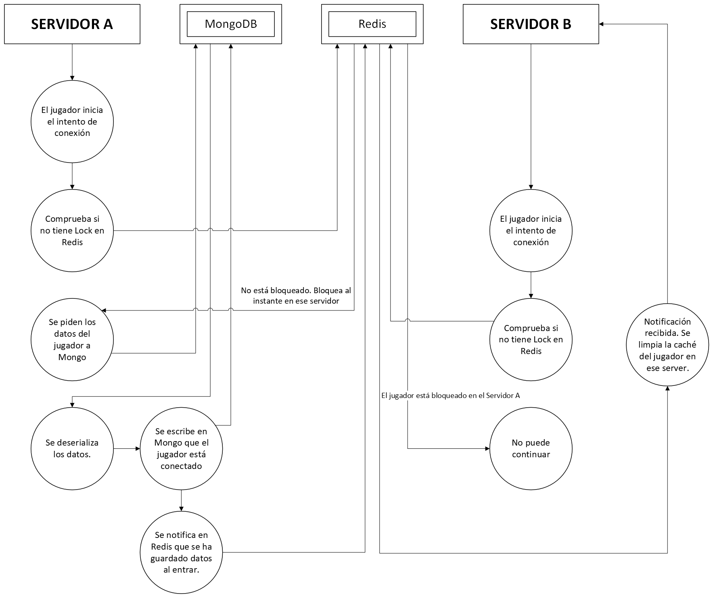
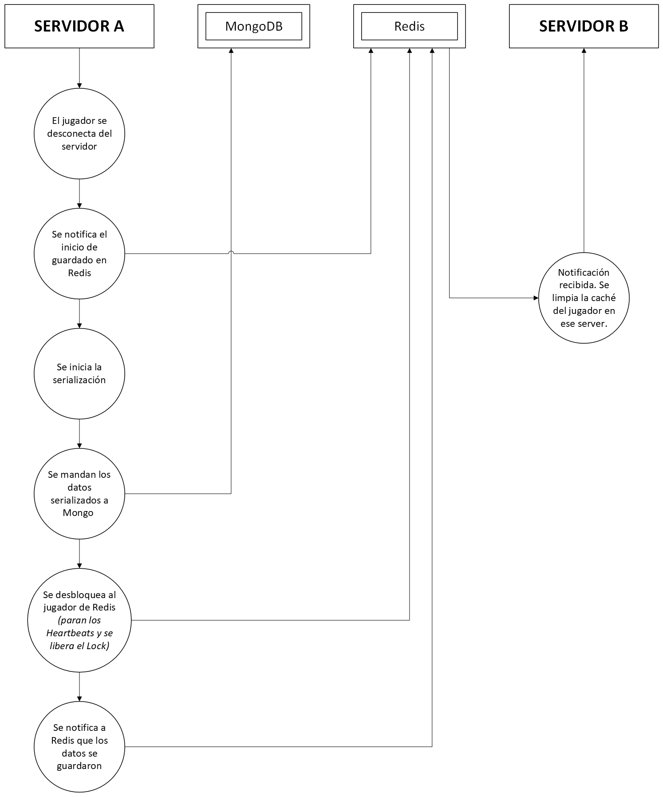

# CobblePersistence
Sistema de guardado de datos de jugador, orientado para Cobblemon, donde los datos son persistentes entre servidores. Usa una estructura de Redis+MongoDB.

## Contenido

* [Despliegue del entorno](#despliegue-del-entorno)
* [Arquitectura](#arquitectura)
  * [MongoDB - Persistencia de datos](#mongodb---persistencia-de-datos)
  * [CobblePersistence - Mod principal](#cobblepersistence---mod-principal)
  * [Redis - Bloqueo y notificaciones](#redis---bloqueo-y-notificaciones)
* [Flujo de transferencia](#flujo-de-transferencia)
  * [DFD - Conexión al servidor](#dfd---conexión-al-servidor)
  * [DFD - Desconexión del servidor](#dfd---desconexión-del-servidor)
* [Conclusión](#conclusión)

## Despliegue del entorno
**El entorno de Redis y MongoDB se puede desplegar a través de Docker Compose.** 

Primero, se necesita añadir un archivo de variables de entorno llamado `.env`. 
La estructura es la siguiente:
```
# Credenciales de MongoDB
MONGO_ROOT_USER=root
MONGO_ROOT_PASSWORD=<PASSWORD>
MONGO_DB=cobblemon

# Credenciales de Redis 
REDIS_PASSWORD=<PASSWORD>
```

Con el `.env` creado, ahora podemos levantar el entorno con el siguiente comando (necesario tener Docker Compose instalado):
```
docker compose up -d
```

Los servicios de Mongo y Redis se inician en los puertos por defecto, `27017` y `6379` respectivamente.

## Arquitectura
En esta sección explicaré la arquitectura completa del mod, y como cada sección funciona dando lugar al sistema.
**Tanto MongoDB como Redis son dependencias obligatorias para el funcionamiento del mod y del servidor.** Si alguno de
estos fallara durante la inicialización, el servidor se apagará para evitar operar sin persistencia.

### MongoDB - Persistencia de datos
El jugador tiene información importante como inventario, estadísticas, logros/avances e incluido los datos de Cobblemon 
como Pokémon de Equipo y PC. Eso y más debemos guardarlo y cargarlo entre servidores. 

Las colecciones de Mongo son el lugar donde guardaremos todos estos datos, la persistencia. Usaremos la colección `players`
para guardar los datos siguiendo este modelo de datos.

> El único índice que se usará es el `_id` que se crea automáticamente, donde se guardará el identificador **UUID** del jugador.
```json
{
  "_id": "d9914dcc-399c-4557-81bf-cec7a1b7274a",
  "username": "Player",
  "lastUpdated": 1787139785,
  "version": 1,
  "actualServer": "ServerA",
  "isOnline": false,
  "minecraftData": {
    "playerData": "{NBT}",
    "stats": {
      "stats": {
        "minecraft:mined": {
          "minecraft:dark_oak_log": 2
        }
      },
      "DataVersion": 3955
    },
    "advancements": {
      "minecraft:adventure/adventuring_time": {
        "criteria": {
          "minecraft:plains": true
        },
        "done": false
      }
    },
    "positions": {
      "ServerA": {
        "dimension": "minecraft:overworld",
        "x": 100.0,
        "y": 64.0,
        "z": 100.0,
        "yaw": 90.0,
        "pitch": 0.0
      }
    }
  },
  "cobblemonData": {
    "party": "{saveToJson}",
    "pc": "{saveToJson}",
    "pokedex": {
      "uuid": "UUID",
      "speciesRecords": {}
    },
    "genericData": "NBT"
  }
}
```
El mod de CobblePersistence tiene un [MongoManager](src/main/java/diosesmon/cobblepersistence/io/storage/MongoManager.java)
donde se inicializa la conexión. 
A la hora de construir la conexión usamos los datos de la configuración del mod.
```json
{
  "mongo": {
    "connection": "localhost:27017",
    "user": "root",
    "password": "<PASSWORD>",
    "database": "cobblemon",
    "minPoolSize": 5,
    "maxPoolSize": 30
  }
}
```
Se ajusta el tamaño del pool de conexiones, el nombre de la base de datos y host del MongoDB. Lo más destacable de esta
conexión es su Driver, que es **Java Reactive Streams Driver para MongoDB**. Este Driver está **especialmente pensado para
tareas que deban ser asíncronas.**

En la clase [PlayerMongo](src/main/java/diosesmon/cobblepersistence/io/storage/PlayerMongo.java) tenemos las llamadas
a la base de datos. Las únicas llamadas son de lectura y guardado de datos, filtrando por `_id` (UUID). Usando la clase
`Mono` de Reactor Core **nos permite hacer las llamadas de forma asíncrona**. Debido a que estas llamadas suelen ser pesadas,
**no queremos que el Main-Thread del servidor quede parado durante este tiempo**. Esta es la solución ideal a este
problema.

Estas llamadas también se hacen desde fuera del Main-Thread, especialmente durante el intento de conexión de un jugador.

### CobblePersistence - Mod principal
Este es el mod principal. Su tarea es hacer las llamadas a Mongo, procesar los datos, enviarlos al jugador, enviar
notificaciones a Redis, etc.

En la clase [PlayerConnectionEvent](src/main/java/diosesmon/cobblepersistence/events/PlayerConnectionEvent.java) tenemos
dos eventos principales: `QUERY_START` y `JOIN`.
- `QUERY_START` **(Todo asíncrono)**:
  - Se ejecuta durante el intento de conexión del jugador *(durante la pantalla de Conectando...)*.
  - Antes de hacer alguna llamada comprueba si el jugador no está con Lock en Redis. Si el jugador está en otra instancia, se deniega la entrada.
  - Si el jugador puede entrar, se activará el Lock en Redis para ese servidor del jugador, permitiendo que no pueda entrar a otro servidor a la vez.
  - Se pide a MongoDB los datos de la UUID que se está intentando conectar. Puede que los datos existan o no.
    - Si los datos existen, es que el jugador ya ha entrado antes.
    - Si los datos no existen, es la primera vez que el jugador entra al servidor.
  - Se guardan los datos en MongoDB, para poder dejar escrito que el jugador está conectado y en cuál servidor.
  - Los datos se guardan en Map temporal llamado `PRELOADED_DATA`. Esto servirá para que el siguiente evento lea los datos.
  - Se crea una sesión en el [SessionManager](src/main/java/diosesmon/cobblepersistence/sync/SessionManager.java) con el versionado de Mongo.
- `JOIN` **(Síncrono)**:
  - Se lee el dato del jugador del Map `PRELOADED_DATA` anterior.
  - Se deserializa el contenido y se manda al jugador.
  - El jugador aparece en el mundo con todos los datos cargados.

Todos los datos que se escriben o leen desde MongoDB están dentro de un objeto de transferencia de datos (DTO) que es
[PlayerData](src/main/java/diosesmon/cobblepersistence/data/PlayerData.java). Este objeto se usará para el serializado
y deserializado, que lo encontraremos en [PlayerSerializer](src/main/java/diosesmon/cobblepersistence/serializer/PlayerSerializer.java):
- `serialize()`: Este método serializará todo el contenido del jugador usando métodos que Minecraft y Cobblemon proporcionan, aunque hay otros métodos de los que hubo que usar **Access Widener** o escribirlos desde cero. Luego, el contenido se manda a un `toDocument()` que escribirá los datos en el formato BSON de MongoDB.
- `deserialize()`: Antes de pasar por este método los datos tendrán que haber sido procesados en un `fromDocument()` donde se lee los datos BSON de MongoDB. Tras eso, este método se encarga de leer cada dato y enviarlo al jugador con sus respectivos métodos.

Algún otro método importante es [MongoPokemonStoreFactory](src/main/java/diosesmon/cobblepersistence/store/MongoPokemonStoreFactory.java).
Este sustituye el guardado por archivos de Cobblemon por uno propio, el de MongoDB. Así no hay discrepancias o problemas de desync.
Esta clase también mantiene las instancias de `PlayerPartyStore` y `PCStore` mientras el jugador está conectado. 
La caché se libera cuando finaliza el proceso de persistencia/transferencia.

### Redis - Bloqueo y notificaciones
La función de Redis en este proyecto es denegar entrada a jugadores que están en otra instancia, y mandar notificaciones
a los servidores de que una operación de persistencia ya ha finalizado.

Todo el contenido de Redis lo tenemos en: [RedisHandshakeManager](src/main/java/diosesmon/cobblepersistence/redis/RedisHandshakeManager.java)
para la suscripción Pub/Sub y notificaciones; [RedisLockManager](src/main/java/diosesmon/cobblepersistence/redis/RedisLockManager.java)
para el manejo del bloqueo del jugador y Heartbeat de su bloqueo.

Se ha usado el **Driver de Lettuce de Redis**. Esto **permite llamadas asíncronas a Redis**.

1. El jugador intenta conectarse. Si no está bloqueado puede acceder.
2. Al acceder se bloquea en Redis para que no pueda entrar a otra instancia.
3. Al desconectarse se desbloquea en Redis para que sí pueda entrar a otra instancia. Además, se crea el state de guardando datos. Al guardar los datos, se descarga de la caché los datos del jugador de todas las instancias de la network.

En el `config.json` podemos encontrar los datos de conexión necesarios:
```json
{
  "redis": {
    "hostname": "localhost",
    "port": 6379,
    "user": "default",
    "password": "<PASSWORD>",
    "timeoutSeconds": 5
  }
}
```
En ese mismo archivo de configuración nos encontramos el identificador del servidor: `"identifier": "ServerA"`

## Flujo de transferencia
El siguiente Diagrama de Flujo de Datos demuestra como es el flujo de transferencia en todo el sistema.
### DFD - Conexión al servidor

### DFD - Desconexión del servidor


## Conclusión
Para una segunda iteración del programa podría estar bien añadir autoguardados, en caso de fallo fatal del sistema dejar
un posible respaldo de datos. Sobretodo en casos donde el jugador lleve horas sin desconectarse del servidor, y sin
guardar sus datos por ello. De todas formas ya hay guardados en caso de crasheos. Pero si el problema fuera mayor, faltaría
programar autoguardados.